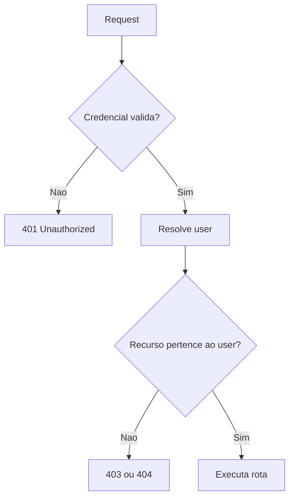
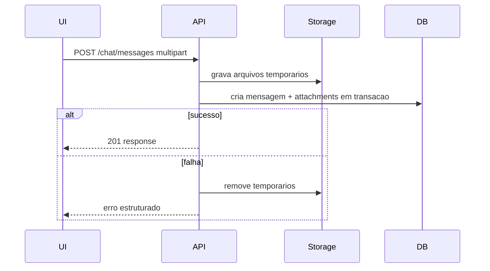

# Roadmap de melhorias

Este roadmap prioriza reducao de risco antes de features novas.

## P0 - Fechar riscos de exposicao

| Item | Resultado esperado | Criterio de aceite |
| --- | --- | --- |
| Usar WSGI em producao | Container de producao nao usa servidor dev Flask. | Dockerfile/compose de producao usam WSGI. |
| Validar config de producao | Startup falha com secrets/placeholders inseguros. | Teste cobre `APP_ENV=production` com `SECRET_KEY` invalida. |
| Autenticacao minima | API deixa de ser publica para dados sensiveis. | Endpoints de chat/anexos/livros exigem credencial. |
| Ownership | Usuario so acessa seus dados. | Testes provam 403/404 para recurso de outro usuario. |

Fluxo alvo de autorizacao:

## P1 - Contrato, dados e operacao

| Item | Resultado esperado | Criterio de aceite |
| --- | --- | --- |
| Alembic/Flask-Migrate | Schema versionado. | CI aplica migrations em banco limpo. |
| Manter enum de status alinhado | Backend, OpenAPI e TS usam `failed`. | Teste de contrato cobre o valor `failed`. |
| Paginacao | Listagens previsiveis. | Endpoints aceitam `limit` e cursor/page com maximo. |
| Cleanup de uploads orfaos | Rotina remove anexos que falharam antes de vincular mensagem. | Job/endpoint interno testado com arquivos orfaos. |
| Transacao de anexos | Envio com anexos nao deixa orfaos. | Falha de `sendMessage` aciona compensacao ou endpoint unico. |

Fluxo alvo para mensagem com anexos:

## P2 - Confiabilidade de IA e observabilidade

| Item | Resultado esperado | Criterio de aceite |
| --- | --- | --- |
| Timeout do gateway | Requests nao ficam presos. | Teste simula provider lento e retorna erro controlado. |
| Rate limit | Protecao de custo e abuso. | Limite por usuario/IP com resposta 429. |
| Streaming real | UI recebe tokens do provedor quando suportado. | E2E ou teste de contrato valida SSE real. |
| Logs estruturados | Requests correlacionaveis. | Cada log contem request_id, route, status, duration_ms. |
| Metricas | Operacao basica mensuravel. | Expor endpoint/collector para latencia, erros e chamadas LLM. |

## P3 - Evolucao de produto e DX

| Item | Resultado esperado | Criterio de aceite |
| --- | --- | --- |
| Refatorar `App.tsx` | Codigo modular e testavel. | Views/hooks extraidos; coverage inclui logica movida. |
| Drawer acessivel | Navegacao mobile inclusiva. | Focus trap, Escape, `role=dialog`, testes de acessibilidade. |
| Alternativa ao swipe | Pin/delete por teclado. | Botoes/menu contextual com teste. |
| Busca real de chats | Botao existente passa a funcionar. | Filtro por titulo/conteudo com testes. |
| Busca vetorial real | FAISS/embeddings opcionais funcionam. | Teste opcional com dependencia AI instalada. |
| Localizacao PT-BR | Labels consistentes. | Datas relativas usam `Intl.RelativeTimeFormat('pt-BR')`. |

## Sequencia recomendada

1. P0 inteiro antes de qualquer deploy publico.
2. P1 antes de aumentar volume de usuarios/dados.
3. P2 antes de usar provedores LLM em producao com custo real.
4. P3 em paralelo com evolucao de UX, desde que P0 esteja fechado.

## Definition of done para fixes

Todo fix relevante deve incluir:

- Teste automatizado no nivel mais proximo do risco.
- Atualizacao de OpenAPI/tipos quando payload mudar.
- Atualizacao de docs quando comando, env ou comportamento mudar.
- Criterio de rollback quando envolver dados ou migracao.
